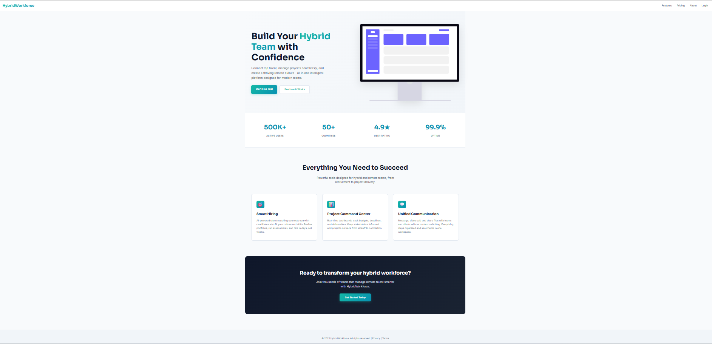
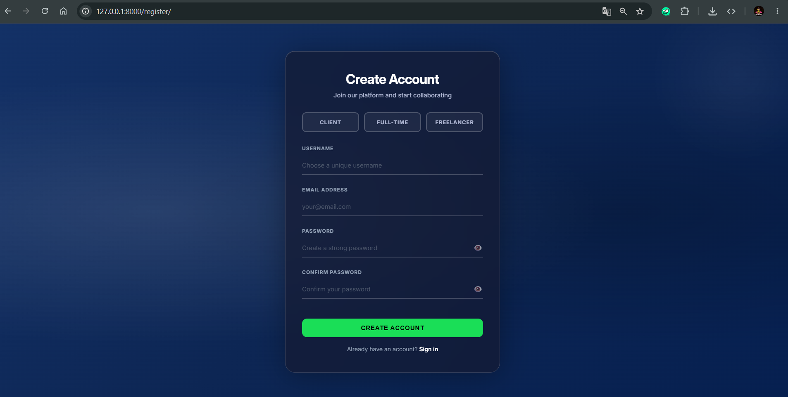
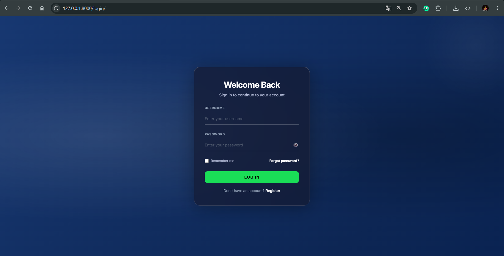
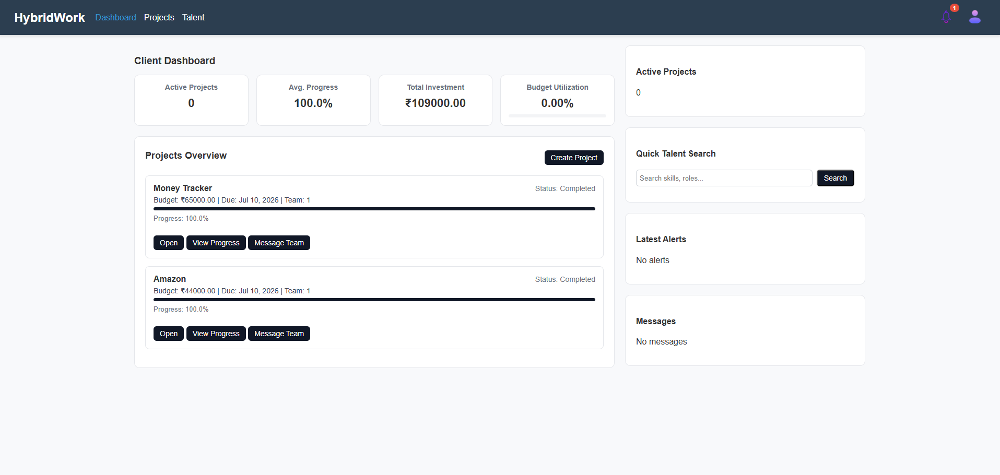
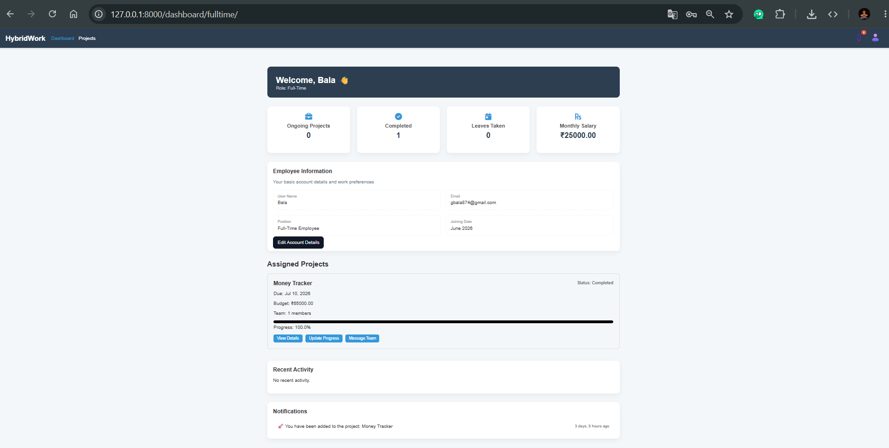
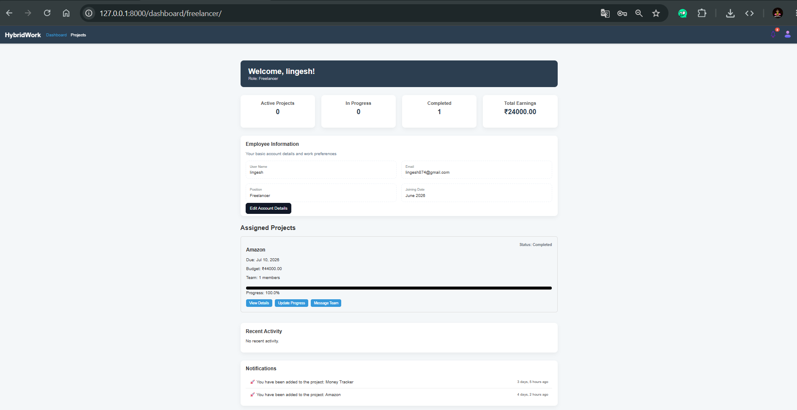
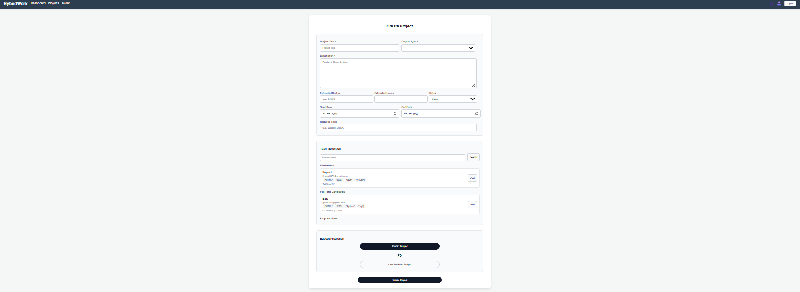
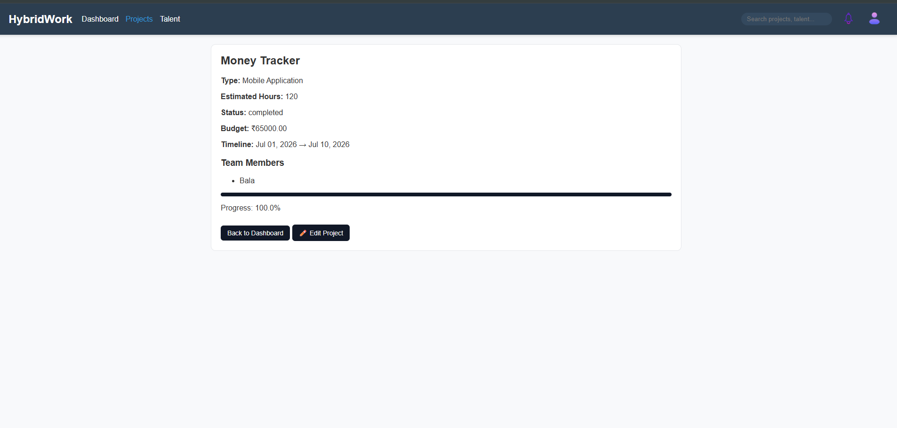
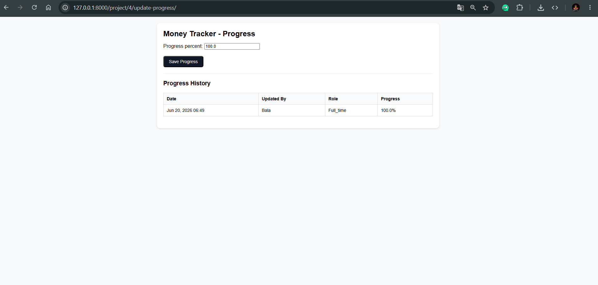

# HybridWorkForce

HybridWorkForce is a Django-based workforce management platform that connects Clients, Full-Time Employees, and Freelancers in a single collaborative workspace.

The platform helps organizations create projects, build hybrid teams, track progress, manage budgets, and monitor project completion efficiently.

---

## Features

### Landing Page
- Modern responsive homepage
- Platform overview and statistics
- Features section
- User onboarding interface

### Authentication System
- User Registration
- Secure Login
- Role-Based Access Control
- Logout Functionality

### User Roles

#### Client
- Create Projects
- Manage Team Members
- Track Project Progress
- Monitor Budget Utilization
- Search Talents
- View Project Analytics

#### Full-Time Employee
- View Assigned Projects
- Update Project Progress
- Track Salary Information
- Receive Notifications
- Manage Account Information

#### Freelancer
- View Assigned Projects
- Update Work Progress
- Track Earnings
- Receive Project Notifications
- Manage Profile Information

---

## Project Modules

### Client Dashboard
- Active Projects Overview
- Budget Management
- Project Monitoring
- Team Communication
- Talent Search

### Project Management
- Create New Projects
- Assign Team Members
- Define Project Timeline
- Budget Prediction
- Progress Tracking

### Employee Dashboard
- Assigned Projects
- Progress Updates
- Salary Information
- Notifications

### Freelancer Dashboard
- Assigned Projects
- Earnings Tracking
- Project Progress Updates
- Notifications

### Progress Tracking System
- Project Completion Percentage
- Progress History
- Activity Monitoring
- Team Contribution Tracking

---

## Technology Stack

### Frontend
- HTML5
- CSS3
- Bootstrap
- JavaScript

### Backend
- Python
- Django

### Database
- SQLite3

### Deployment
- PythonAnywhere

---

## Screenshots

### Home Page



### Registration Page



### Login Page



### Client Dashboard



### Full-Time Dashboard



### Freelancer Dashboard



### Create Project



### Project Details



### Progress Tracking



---
## Clone Repository

```bash
git clone https://github.com/Balaganesh-874/Hybrid_Workforce.git
cd hybrid_workforce
```

## Installation

### Create Virtual Environment

```bash
python -m venv venv
```

### Activate Environment

```bash
venv\Scripts\activate
```

### Install Dependencies

```bash
pip install -r requirements.txt
```

### Apply Migrations

```bash
python manage.py makemigrations
python manage.py migrate
```

### Run Server
```bash
python manage.py runserver
```

### Open

```text
http://127.0.0.1:8000/
```

## Project Structure

```text
HybridWorkForce/
│
├── accounts/
├── dashboard/
├── projects/
├── templates/
├── static/
├── media/
├── db.sqlite3
├── manage.py
└── requirements.txt
```

## Future Enhancements
* Real-Time Chat System
* Video Meeting Integration
* AI Talent Recommendation
* Project Risk Prediction
* Attendance Management
* Payment Gateway Integration
* Email Notifications
* Mobile Application Support

## Deployment (PythonAnywhere)

```python
DEBUG = False

ALLOWED_HOSTS = [
    'balaganesh.pythonanywhere.com',
    '127.0.0.1',
    'localhost'
]
```

```bash
python manage.py collectstatic
```

## Live Demo

[HybridWorkForce Live Site](https://balaganesh.pythonanywhere.com)

## Author

**Balaganesh**

Python Django Developer

GitHub: https://github.com/Balaganesh-874

## License

This project is developed for educational and portfolio purposes.

